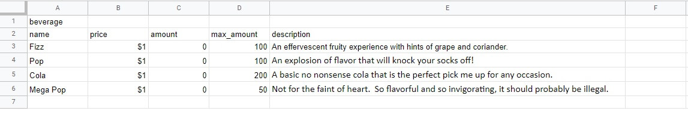

# Welcome to ColaCo's Virtual Vending Machine!
## Introduction

# UX
## User Stories
### Client Users
### Admin
## Design Choices
## Wireframes and Live Application
### Database Wireframes

### Application Wireframes
### Live Application

# Technology used
+ Node.js – Runtime application that allows JS to be used outside of a browser.
+ JavaScript - Allows for user interaction and dynamic function on the application. This also allows all the backend functions to work because of the runtime application Node.js.
+ Express.js – Backend web framework used with Node.js for server framework.
+ Knex.js – ORM (object-relational mapper) used to make SQL queries easier and faster to write.
+ PostgreSQL – Relational Database used.
+ React.js - JavaScript Library for front-end development.
+ HTML - Skeleton frame of the application.
+ CSS - Beautifies the skeleton (HTML).

# Testing
## Developer Testing Specifications
### Developer Testing Systems
### Developer Testing Methods

# Bugs and Other Problems
## Bugs
## Other Problems

# Deployment
## GitHub
## Heroku
### Notes
+ Postgres requires a secure connect by default
    + The work around is:
        + Add a config to heroku config vars: (PGSSLMODE=no-verify)
        + Add an additional line to knexfile.js:
            + ssl: { rejectUnauthorized: false },
            + This should be added after the connection string
+ Due to the requirements of this project (api and user interface sharing single github repo) the migrations for the PostgreSQL database must be done at deployment.
    + The migration string can be found in the scripts of package.json
    + Potientially forward AND backwards migrations can be made here but each will be made at the end of a successful herou build and careful attention must be paid to the process.
        + 2 additional scripts required for this are **heroku-postbuild** and **install-api**.
        + **heroku-postbuild** will be the first script called and will force heroku to call **install-api** next which will allow a non-root dir installation to heroku.

# Tools

# Acknowledgements
