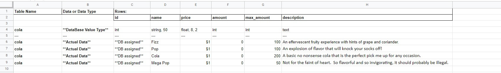
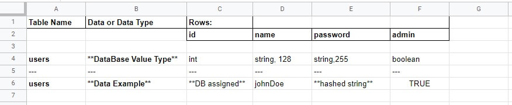
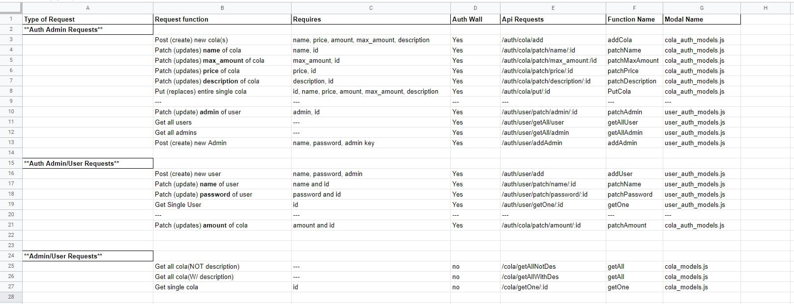

# Welcome to ColaCo's Virtual Vending Machine!

# Table Of Contents
[Introduction]

[UX](#ux)
+ [User Stories](#user-stories)
    + [Clients](#clients)
    + [Admin](#admin)
+ [Design Choices](#design-choices)
+ [Wireframes and Live Application](#wireframes-and-live-application)
    + [Database Wireframes](#database-wireframes)
    + [Application Wireframes](#application-wireframes)
    + [Live Application](#live-application)

[Technology](#technology)

[Testing](#testing)
+ [Developer Testing Specifications](#developer-testing-specifications)
+ [Developer Testing Systems](#developer-testing-systems)
+ [Developer Testing Methods](#developer-testing-methods)

[Bugs and Other Problems](#bugs-and-other-problems)
+ [Bugs](#bugs)
+ [Other Problems](#other-problems)

[Deployment](#deployment)
+ [GitHub](#github)
+ [Heroku](#heroku)

[Tools](#tools)

[Acknowledgements](#Acknowledgements)

## Introduction

# UX
## User Stories
### Clients
#### General
+ As a client, I want to be able to view the vending machine’s entire selection of cola.
+ As a client, I want to be able to view a detailed description of a cola.
#### Auth
+ As a client, I am a repeat customer and I want to save my purchase information.
+ As a client, I want to be able to purchase a cola.
+ As a client, I want to be able to view my login name.
+ As a client, I want to be able to update my name.
+ As a client, I want to be able to change my password.

### Admin
#### General
+ As an admin, I want to add a new cola to the vending machine.
+ As an admin, I want to be able to change the name of a cola.
+ As an admin, I want to be able to update the price of a cola.
+ As an admin, I want to be able to change the amount currently stocked in the vending machine.
+ As an admin, I want to be able to change the max available of a cola.
+ As an admin, I want to be able to update the description of a cola.
+ As an admin, I want to be able to view all products including id and description.
#### Auth
+ As an admin, I need to be able to login to preform my duties.
+ As an admin, I want to be able to update my name.
+ As an admin, I want to be able to change my password.
+ As an admin, I want to be able to change a client’s status to admin.
+ As an admin, I want to be able to view my login name.
+ As an admin, I want to see all the admins.
+ As an admin, I want to see all the customers.

## Design Choices
### Assumptions
+ The vending machine will only dispense one cola at a time.
+ Frequent users will want to have a login to remember their card information.
+ ColaCo will want to track who is buying their cola for ‘reasons’.
+ Users will want a method of payment that does not require logging in.

## Wireframes and Live Application
### Database Wireframes
+ Wireframe for Cola table

+ Wireframe for Users table

### API Wireframes
+ Wireframe for RESTful API

### Application Wireframes
### Live Application

# Technology
+ Node.js – Runtime application that allows JS to be used outside of a browser.
+ JavaScript - Allows for user interaction and dynamic function on the application. This also allows all the backend functions to work because of the runtime application Node.js.
+ Express.js – Backend web framework used with Node.js for server framework.
+ Knex.js – ORM (object-relational mapper) used to make SQL queries easier and faster to write.
+ PostgreSQL – Relational Database used.
+ React.js - JavaScript Library for front-end development.
+ HTML - Skeleton frame of the application.
+ CSS - Beautifies the skeleton (HTML).

# Testing
## Developer Testing Specifications
### Developer Testing Systems
### Developer Testing Methods

# Bugs and Other Problems
## Bugs
## Other Problems

# Deployment
## GitHub
## Heroku
### Notes
+ Postgres requires a secure connect by default
    + The work around is:
        + Add a config to heroku config vars: (PGSSLMODE=no-verify)
        + Add an additional line to knexfile.js:
            + ssl: { rejectUnauthorized: false },
            + This should be added after the connection string
+ Due to the requirements of this project (api and user interface sharing single github repo) the migrations for the PostgreSQL database must be done at deployment.
    + The migration string can be found in the scripts of package.json
    + Potientially forward AND backwards migrations can be made here but each will be made at the end of a successful herou build and careful attention must be paid to the process.
        + 2 additional scripts required for this are **heroku-postbuild** and **install-api**.
        + **heroku-postbuild** will be the first script called and will force heroku to call **install-api** next which will allow a non-root dir installation to heroku.

# Tools
+ [Adobe Color Wheel](https://color.adobe.com/create/color-wheel)
    + Used to help pick color schemes.
+ [Bootstrap](https://getbootstrap.com/)
    + Used as framework.
+ [Font Awesome](https://fontawesome.com/)
    + Imported icons are from here.
+ [GitHub](https://github.com/)
    + Used for version control and deploys application information to Heroku.
+ [Google Fonts](https://fonts.google.com/)
    + Imported font families found here.
+ [Heroku](https://www.heroku.com/)
    + Site where application is deployed.
+ [Insomnia](https://insomnia.rest/)
    + Used as a interface to send requests to RESTFUL API.
+ [Jigsaw (Validation Service)](https://jigsaw.w3.org/css-validator/)
    + Used to identify errors in CSS.
+ [JSHint](https://jshint.com/)
    + Used to identify errors in JavaScript.
+ [JSON formatter](https://jsonformatter.org/)
    + Used to read long strings of JSON
+ [Lighthouse](https://developers.google.com/web/tools/lighthouse)
    + Used to check for performance, accessibility, best practices, and SEO.
+ [Techsini](https://techsini.com/multi-mockup/)
    + Used for their viewable responsiveness PNG.
+ [TinyPNG](https://tinypng.com/)
    + Used to Minimize KB load per image.
+ [VSCode](https://code.visualstudio.com/)
    + Integrated development environment used.
+ [W3C Validator](https://validator.w3.org/)
    + Used to identify errors in markup.

# Acknowledgements
+ [Bootstrap](https://getbootstrap.com/)
    + A framework used to help speed up development and provide a better overall UX.
+ [Heroku Dev Center](https://devcenter.heroku.com/)
    + A great source of information about Heroku, its addions, and errors that can happen.
+ [Knex.js](http://knexjs.org/)
    + An overwhelming amount of documentation about knex.
+ [MDN Web Docs](https://developer.mozilla.org/en-US/)
    + Invaluable source of information about JavaScript, HTML, and CSS.
+ [Stack Overflow](https://stackoverflow.com/)
    + A great source of information to find a starting place for research.
+ [React](https://reactjs.org/)
    + The source for everything about React.js.
+ [W3Schools](https://www.w3schools.com/)
    + Extremely helpful for explaining base HTML, CSS, and JavaScript principles.
+ [World Wide Web Consortium (W3C)](https://www.w3.org/)
    + Used to understand basic standardization practices for web-based apps.

## Images
https://unsplash.com/photos/x7JSGI2ZVeY -- pille-r-priske-x7JSGI2ZVeY-unsplash