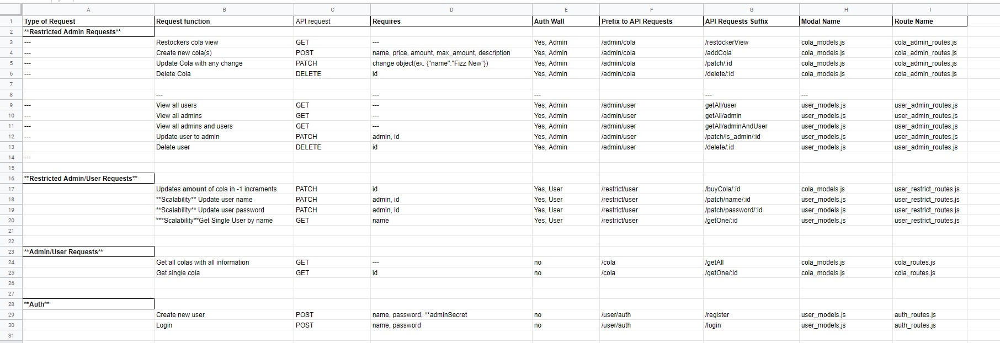

# Welcome to ColaCo's Virtual Vending Machine!

# Table Of Contents
[Introduction]

[UX](#ux)
+ [User Stories](#user-stories)
    + [Clients](#clients)
    + [Admin](#admin)
+ [Design Choices](#design-choices)
+ [Wireframes and Live Application](#wireframes-and-live-application)
    + [Database Wireframes](#database-wireframes)
    + [Application Wireframes](#application-wireframes)
    + [Live Application](#live-application)

[Technology](#technology)

[Testing](#testing)
+ [Developer Testing Specifications](#developer-testing-specifications)
+ [Developer Testing Systems](#developer-testing-systems)
+ [Developer Testing Methods](#developer-testing-methods)

[Bugs and Other Problems](#bugs-and-other-problems)
+ [Bugs](#bugs)
+ [Other Problems](#other-problems)

[Deployment](#deployment)
+ [GitHub](#github)
+ [Heroku](#heroku)

[Tools](#tools)

[Acknowledgements](#Acknowledgements)

## Introduction

# UX
## User Stories
### Clients
#### General
+ As a client, I want to be able to view the vending machine’s entire selection of cola.
+ As a client, I want to be able to view a detailed description of a cola.
#### Auth
+ As a client, I am a repeat customer and I want to save my purchase information.
+ As a client, I want to be able to purchase a cola.
+ As a client, I want to be able to view my login name.
+ As a client, I want to be able to update my name.
+ As a client, I want to be able to change my password.

### Admin
#### General
+ As an admin, I want to add a new cola to the vending machine.
+ As an admin, I want to be able to change the name of a cola.
+ As an admin, I want to be able to update the price of a cola.
+ As an admin, I want to be able to change the amount currently stocked in the vending machine.
+ As an admin, I want to be able to change the max available of a cola.
+ As an admin, I want to be able to update the description of a cola.
+ As an admin, I want to be able to view all products including id and description.
#### Auth
+ As an admin, I need to be able to login to preform my duties.
+ As an admin, I want to be able to update my name.
+ As an admin, I want to be able to change my password.
+ As an admin, I want to be able to change a client’s status to admin.
+ As an admin, I want to be able to view my login name.
+ As an admin, I want to see all the admins.
+ As an admin, I want to see all the customers.

## Design Choices
### API
#### Routes
##### Route Notes
+ A single update was used with Auth instead of having multiple routes for updates which could provide more security.
+ There are two levels of middleware restriction admin (restricted_admin_middleware.js) and user(restricted_middleware.js)
+ All paths start on the root of the api or `https://colaco-vending-machine.herokuapp.com/` for this application.
+ There currently is no front end ability to pass a restricted point. In order to access the API with restricted middleware reinforcement a api request program like insomnia or postman must be used.
    + Additionally the header must have `authorization: <webtoken>` within it. The webtoken can be found as a return from logging in.
    + In order to receive a admin token a accurate `admin_secret: <secret>` must be submitted with login information when creating a user.
    + These middleware tokens only last a total of 1 hour after login.

##### Restricted Admin Routes
+ Restockers cola view.
    + Request:
        + GET
    + Requires:
        + ---
    + Returns:
        + All cola:
            + id
            + name
            + amount
            + max_amount
            + price
    + Restricted:
        + Yes, admin
    + Path:
        + `/admin/cola/restockerView`

+ Create new cola(s).
    + Request:
        + POST
    + Requires:
        + Cola
            + name (string)
            + price(float)
            + amount(int)
            + max_amount(int)
            + description(string)
    + Returns:
        + Number of cola(s) entered
        + Full print out of all cola information for each cola.
    + Restricted:
        + Yes, admin
    + Path:
        + `/admin/cola/addCola`

+ Update cola with single or multiple changes.
    + Request:
        + PATCH
    + Requires:
        + Any single change or multiple changes to cola.
        + Ex. `"amount":25`
    + Returns:
        + The entire cola object that was modified.
    + Restricted:
        + Yes, admin
    + Path:
        + `/admin/cola/patch/:id`

+ Delete Cola
    + Request:
        + Delete
    + Requires:
        + user
            + id
    + Returns:
        + Id of the deleted user.
    + Restricted:
        + Yes, admin
    + Path:
        + `/admin/user/delete/:id`

+ View all users.
    + Request:
        + GET
    + Requires:
        + ---
    + Returns:
        + All users that are not of admin status
        + user:
            + id
            + name
    + Restricted:
        + Yes, admin
    + Path:
        `/admin/user/getAll/user`

+ View all admin.
    + Request:
        + GET
    + Requires:
        + ---
    + Returns:
        + All users that are not of admin status
        + user:
            + id
            + name
    + Restricted:
        + Yes, admin
    + Path:
        `admin/user/getAll/admin`

+ View all admin and users.
    + Request:
        + GET
    + Requires:
        + ---
    + Returns:
        + All users that are not of admin status
        + user:
            + id
            + name
    + Restricted:
        + Yes, admin
    + Path:
        + `admin/user/getAll/adminAndUser`

+ Update user to admin.
    + Request:
        + POST
    + Requires:
        + user
            + `is_admin: <boolean>`
    + Returns:
        
    + Restricted:
    + Path:
+ Delete user.
    + Request:
    + Requires:
    + Returns:
    + Restricted:
    + Path:

##### Restricted Admin/User Routes
+ Remove single cola after purchase.
    + Request:
    + Requires:
    + Returns
    + Restricted:
    + Path:
+ Update user name.
    + Not implemented
+ Update user password
    + Not implemented
+ View single user by name
    + Not implemented

##### Admin/User Routes
+ Get all colas
    + Request:
    + Requires:
    + Returns:
    + Restricted:
    + Path:
+ Get single cola
    + Request:
    + Requires:
    + Returns:
    + Restricted:
    + Path:

##### Authentication Routes
+ Register admin/user
    + Request:
    + Requires:
    + Returns:
    + Restricted:
    + Path:
+ Login admin/user
    + Request:
    + Requires:
    + Returns:
    + Restricted:
    + Path:

#### Database Tables
##### users
+ 5 columns
    + id - int - PostgreSQL automatically tracks this number.
    + name - string - Name of the user.
    + password string - password for the user.
    + is_admin - boolean - Determines if the user is a admin
    + purchases - string - **Scalability** A stringified JSON object that remembers purchase history of a user

##### cola
+ 6 columns:
    + id - int - PostgreSQL automatically tracks this number
    + name - string - Name of the cola
    + price - float - US dollar amount to purchase this item
    + amount - int - The 'physical' count within the vending machine
    + max_amount - int - The maximum 'physical' count a vending machine can hold (due to production rarity)
    + description - string - A basic description of a cola

### React.js
#### Home
+ A generic and colorful linear gradient was used as a backgroud.
+ Each cola product gets its own template which includes:
    + The Cola's name is displayed on a blank can png. This effect gives the appearance of colas being displayed in a vending machine.
    + Each cola displays its price and if it is in stock or not.

#### Product Details
+ Each detailed products page gives additional information about the product:
    + The cola's description.
    + A way to purchase the cola.
    + Return to the home screen.
+ The buy button uses Stripes API to give a secure connection for uses to purchase cola(s).

## Wireframes and Live Application
### Database Wireframes
+ Wireframe for Cola table

+ Wireframe for Users table

### API Wireframes
+ Wireframe for RESTful API

### Application Wireframes

### Live Application

## Scalability
+ Finalizing a way for users to login, and update their username and password.
+ Creating a way for a user to delete their own account.
+ A frame has been created to give the ability to have selective views for different users. (Ex. Admins and users)

# Assumptions
+ The vending machine will only dispense one cola at a time.
+ Frequent users will want to have a login to remember their card information. *Scalability
+ ColaCo will want to track who is buying their cola for ‘reasons’. *Scalability
+ Users will want a method of payment that does not require logging in.
+ Users will only use credit or debit cards.

# Technology
+ Node.js – Runtime application that allows JS to be used outside of a browser.
+ JavaScript - Allows for user interaction and dynamic function on the application. This also allows all the backend functions to work because of the runtime application Node.js.
+ Express.js – Backend web framework used with Node.js for server framework.
+ Knex.js – ORM (object-relational mapper) used to make SQL queries easier and faster to write.
+ PostgreSQL – Relational Database used.
+ React.js - JavaScript Library for front-end development.
+ Stripe - API that accepts payment information.
+ HTML - Skeleton frame of the application.
+ CSS - Beautifies the skeleton (HTML).

# Testing
## Developer Testing Specifications
### Developer Testing Systems
### Developer Testing Methods

# Bugs and Other Problems
## Bugs
### API
+ When a user tries to create a login with a existing username PostgreSQL does not return a error number.
    + Caused by:
        + PostgreSQL's normal functions.
    + Fix:
        + PostgreSQL returns a undefined instead of a number so an additional error catch was added to run on a undefined error and tells the user that they need to delect a different username.
    + Thought(s):
        + Given more time this should be more accurately handled with determining why PostgreSQL isnt giving an error code; or find a more certain way of detecting a unique key error.

## Other Problems
### React
+ After a successful deployment of React, Heroku wouldn't run the application.
	+ Caused by:
		+ Location of the React content. (Due to the nature of using a single git repo for tracking the application build process numerous problems were created.)
	+ Fix:
		+ A Second git repo was created with the sole purpose to receive a copy and paste of the entire application at deployment intervals. This was necessary because it allowed control over where the location of all the files. Unlike the node.js server for this project, React did not play nice with its nonstandard root directory.
	+ Thoughts:
		+ Provided with additional time, a prettier solution could be devised; however, to complete this project on time, this inelegant solution was chosen.

# Deployment
## Stripe
+ Go to **Stripe.com** and click **Start Now**.
+ Create a new account.
+ Click **Developer** tab.
+ Click **API Keys** to find **Publishable Key** and **Secret Key**.
+ Click **Webhooks** tab.
<!-- + click **Add Endpoint** and enter the new apps Heroku address with **/invoice/wh/** at the end of the address.
+ Stripe will now provide you with a **Signing Secret Key**. -->

## GitHub
+ This will require two separate github repos to deploy properly to Heroku.
### API Repo
+ Go to the location of the original repository in GitHub, [https://github.com/Richardaeld/cola-vending-machine](https://github.com/Richardaeld/cola-vending-machine).
+ Click on the **Code** button to get the drop-down menu.
+ Copy the HTTPS address provided.
+ Create a new GitHub/GitPod project (to house the new clone) and then open this new project.
+ Go to the Bash and type, `git clone <HTTPS>`, paste the HTTPS address found in the GitHub page (don't forget the space after "clone") and press enter.
+ A clone will be created within a new folder called "cola-vending-machine" (name of the original repository).
+ Unpack everything from this new folder to the root of the GitPod project tree and the foundation of the project will be setup.
+ (Optional) The **react_app** folder can be deleted anlong with the **cola-vending-machine** folder.
### React.js Repo
+ Go to the location of the original repository in GitHub, [https://github.com/Richardaeld/cola-vending-machine](https://github.com/Richardaeld/cola-vending-machine).
+ Click on the **Code** button to get the drop-down menu.
+ Copy the HTTPS address provided.
+ Create a new GitHub/GitPod project (to house the new clone) and then open this new project.
+ Go to the Bash and type, `git clone <HTTPS>`, paste the HTTPS address found in the GitHub page (don't forget the space after "clone") and press enter.
+ A clone will be created within a new folder called "cola-vending-machine" (name of the original repository).
+ Unpack **react_app** from this new folder to the root of the GitPod project tree and delete the imported folder, "cola-vending-machine".

## Heroku
+ This will require two separate heroku apps to deploy properly and function.
### API
+ Log into Heroku.
+ Create a new app on Heroku by clicking **New** and following the directions.
### Link Heroku and GitHub:
+ Log into Heroku.
+ From the **Personal Apps** page, click on the new app that was just created in Heroku.
+ Click on **Deploy**.
+ Click on **GitHub** from **Deployment Method** section.
+ Enter your GitHub information and the name of the cloned repository into the "Connect to GitHub" section.
### Create a Postgres SQL Server.
+ From your new apps base page, click on **Resources**.
+ Click on **Find More Add-Ons**.
+ Select **Postgres**.
+ Finish setup.
## Heroku Variables For API
+ Share `env.py` information with Heroku.
    + Click on **Settings**.
    + Click on **Reveal Config Vars** from **Config Vars** section.
    + Add all of the `env.py` key and value pairs without their quotations.
        + Ex. (key) == (value)
        <!-- + ADMIN_CREATION_KEY == *Any string you come up with* -->
        <!-- + ADMIN_SECRET == *Any string you come up with* -->
        + COOKIESECURE == false
        + DATABASE_URL == (key provided from Postgres server)
        + DB_ENVIRONMENT == production
        + PGSSLMODE == no-verify
        + SAVEUNITITIALIZED == true
        + SECRET == *Any string you come up with*
        + USE_AWS == True
        <!-- + STRIPE_PUBLIC_KEY == (provided by **Stripe** as **Publishable key**) -->
        <!-- + STRIPE_SECRET_KEY == (provided by **Stripe** as **Secret Key**) -->
        <!-- + STRIPE_WH_SECRET == (provided by **Stripe** as **Webhook Signing Secret**) -->
### React.js
+ Log into Heroku.
+ Create a new app on Heroku by clicking **New** and following the directions.
### Link Heroku and GitHub:
+ Log into Heroku.
+ From the **Personal Apps** page, click on the new app that was just created in Heroku.
+ Click on **Deploy**.
+ Click on **GitHub** from **Deployment Method** section.
+ Enter your GitHub information and the name of the cloned repository into the "Connect to GitHub" section.

### Heroku Notes
+ Postgres requires a secure connect by default
    + The work around is:
        + Add a config to heroku config vars: (PGSSLMODE=no-verify)
        + Add an additional line to knexfile.js:
            + ssl: { rejectUnauthorized: false },
            + This should be added after the connection string
+ Due to the requirements of this project (api and user interface sharing single github repo) the migrations for the PostgreSQL database must be done at deployment.
    + The migration string can be found in the scripts of package.json
    + Potientially forward AND backwards migrations can be made here but each will be made at the end of a successful herou build and careful attention must be paid to the process.
        + 2 additional scripts required for this are **heroku-postbuild** and **install-api**.
        + **heroku-postbuild** will be the first script called and will force heroku to call **install-api** next which will allow a non-root dir installation to heroku.
+ Due to the requirements of this project (api and user interface sharing single github repo) React.js would not deploy from the repo it was build in.
    + To deploy the entire project needs to be copied to a new repo and extracted from its react_app folder to the root of the repo.
    + With this step completed the new repo can be successfully deployed.

# Tools
+ [Adobe Color Wheel](https://color.adobe.com/create/color-wheel)
    + Used to help pick color schemes.
+ [Bootstrap](https://getbootstrap.com/)
    + Used as framework.
+ [Font Awesome](https://fontawesome.com/)
    + Imported icons are from here.
+ [GitHub](https://github.com/)
    + Used for version control and deploys application information to Heroku.
+ [Google Fonts](https://fonts.google.com/)
    + Imported font families found here.
+ [Heroku](https://www.heroku.com/)
    + Site where application is deployed.
+ [Insomnia](https://insomnia.rest/)
    + Used as a interface to send requests to RESTFUL API.
+ [Jigsaw (Validation Service)](https://jigsaw.w3.org/css-validator/)
    + Used to identify errors in CSS.
+ [JSHint](https://jshint.com/)
    + Used to identify errors in JavaScript.
+ [JSON formatter](https://jsonformatter.org/)
    + Used to read long strings of JSON
+ [Lighthouse](https://developers.google.com/web/tools/lighthouse)
    + Used to check for performance, accessibility, best practices, and SEO.
+ [Stripe](https://stripe.com/)
    + Used to allow users to make payments with credit cards.
+ [Techsini](https://techsini.com/multi-mockup/)
    + Used for their viewable responsiveness PNG.
+ [TinyPNG](https://tinypng.com/)
    + Used to Minimize KB load per image.
+ [VSCode](https://code.visualstudio.com/)
    + Integrated development environment used.
+ [W3C Validator](https://validator.w3.org/)
    + Used to identify errors in markup.

# Acknowledgements
+ [Bootstrap](https://getbootstrap.com/)
    + A framework used to help speed up development and provide a better overall UX.
+ [Heroku Dev Center](https://devcenter.heroku.com/)
    + A great source of information about Heroku, its addions, and errors that can happen.
+ [Knex.js](http://knexjs.org/)
    + An overwhelming amount of documentation about knex.
+ [MDN Web Docs](https://developer.mozilla.org/en-US/)
    + Invaluable source of information about JavaScript, HTML, and CSS.
+ [Stack Overflow](https://stackoverflow.com/)
    + A great source of information to find a starting place for research.
+ [Stripe api docs](https://stripe.com/docs)
    + Detailed instructions on how to use their api.
+ [React](https://reactjs.org/)
    + The source for everything about React.js.
+ [W3Schools](https://www.w3schools.com/)
    + Extremely helpful for explaining base HTML, CSS, and JavaScript principles.
+ [World Wide Web Consortium (W3C)](https://www.w3.org/)
    + Used to understand basic standardization practices for web-based apps.

## Images
https://unsplash.com/photos/x7JSGI2ZVeY -- pille-r-priske-x7JSGI2ZVeY-unsplash
https://unsplash.com/photos/nbrvUKkWP0Q -- unbranded_can.jpg
